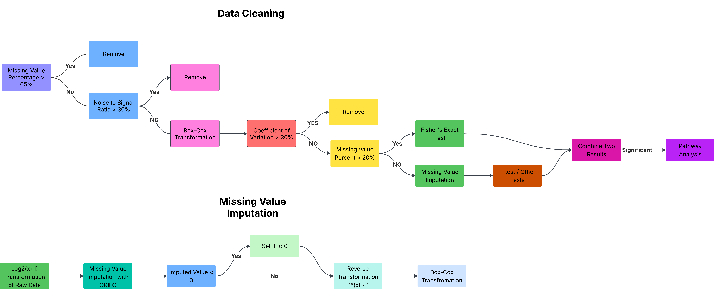

```{r setup, include=FALSE}
knitr::opts_chunk$set(echo = FALSE, dev = "png", dev.args = list(type = "cairo"), dpi = 300, fig.retina = 3, out.width = "100%")
```

```{r, include = FALSE, echo = FALSE}
####Libraries
suppressPackageStartupMessages({
library(kableExtra)
library(readxl)
library(htmltools)
library(janitor)
library(tidyverse)
library(readxl)
library(purrr)
library(writexl)
library(broom)
library(imputeLCMD)
library(ggrepel)
library(knitr)
library(kableExtra)
library(DT)
library(ggVennDiagram)
})


set.seed(123)
```

```{r, eval = TRUE, echo = FALSE, message = FALSE, warning=FALSE, include = FALSE}
# Run this to populate the results:
annotated_path <- "../01_annotated"
source("../01_annotated/main.R")
```


# Introduction and Data Overview

Juvenile myelomonocytic leukemia (JMML) is a rare form of chronic leukemia (cancer of the blood) that affects children, commonly those aged four and younger. The name JMML now encompasses all diagnoses formerly referred to as juvenile chronic myeloid leukemia (JCML), chronic myelomonocytic leukemia of infancy, and infantile monosomy 7 syndrome. The average age of patients at diagnosis is two (2) years old. The World Health Organization has included JMML as a subcategory of myelodysplastic and myeloproliferative disorders. (From: https://en.wikipedia.org/wiki/Juvenile_myelomonocytic_leukemia)

Metabolomic profiles were measured from dry blood spots from newborn screening card of 58 JMML patients and 58 healthy controls.
Two sets of mass-spectrometry data were generated for each of the 116 newborns, using different ways of separating the compounds:

1) an untargeted platform using reverse-phase negative with a PFAS-free kit (RPNPF) ionization modes 

2) HILIC chromatography with positive ionization (ZHP).


Our primary goal in this analysis is biomarker discovery. We aim to use mass spectrometry data from dried blood spots to classify newborns as either JMML-positive or JMML-negative.

```{r, out.width='2400px', out.height='100%'}

```


```{r, echo=FALSE, results='asis', warning=FALSE}
script <- "../01_annotated/01a_save_data_rds_lilly_bc.R"

code <- paste(readLines(script), collapse = "\n")
cat("```r\n", code, "\n```\n", sep = "")
```

```{r, echo=FALSE, results='asis', warning=FALSE}
script <- "../01_annotated/01b_missingness.R"

code <- paste(readLines(script), collapse = "\n")
cat("```r\n", code, "\n```\n", sep = "")
```


## Missingness Assessment

The first step for our workflow is to segment our data based on missing values for each metabolite, based on on the JMML and Control groups.

Each metabolite is going to fall into one of three groups:

- M1 Missing less than 20%: We are going to pass this to a T-Test, after imputing the values.

- M2 Missing between 20% - 65% : We are going to apply Fisher's exact test to assess JMML-related missingness.

- M3 Missing more than 65%+: Remove the metabolite completely from the analysis.

---

```{r, echo = FALSE}
#print(p_removed_ZHP)
knitr::include_graphics("../res/annotated/QC/ZHP_missingness_threshold_excluded.png")
```

---

```{r, echo = FALSE}
knitr::include_graphics("../res/annotated/QC/RPNPF_missingness_threshold_excluded.png")
```

---
 
#  Data Preprocessing & Quality Control

## Remove High-Missing Features

Goal: Remove Metabolites with more than 65%+ NA values in JMML and Control Groups.

## Noise-to-Signal Filter

Goal: Remove Metabolites with a Noise-to-Signal Ratio greater than 0.3

- For each metabolite, we take the median of the pooled blank samples and pooled QC experimental samples.
- We calculate the ratio: (median of the pooled blank) / (median of pooled QC)
- We remove metabolites with a Noise-to-Signal ratio greater than 0.3.


## Hemoglobin Correlation Analysis

To identify potential confounding by blood volume, we examine the relationship between metabolite intensity and hemoglobin concentration (mg/mL), which serves as a proxy for total blood in the dried spot.

If a metabolite's intensity is strongly correlated with hemoglobin, it may reflect differences in sample volume rather than true biological variation. In such cases, apparent enrichment could be an artifact of having more blood rather than more of the metabolite.

We use Spearman’s correlation to assess this relationship, as it captures monotonic trends without assuming linearity or normal distributions—ideal for high-variance metabolomics data.

---


```{r, echo = FALSE}
#print(p_hist_rho_ZHP)
knitr::include_graphics("../res/annotated/histogram_rho_ZHP.png")
```

---

```{r, echo = FALSE}
knitr::include_graphics("../res/annotated/histogram_rho_RPNPF.png")
```

---

### Hemoglobin Correlation Table

```{r, echo = FALSE}
combined_hgb_cor <- read_xlsx("../res/annotated/hemoglobin_correlated_metabolites.xlsx")

datatable(
  combined_hgb_cor %>%
    mutate(across(where(is.numeric), ~ round(., 2))),
  options = list(
    autoWidth = TRUE,
    scrollX = TRUE,
    pageLength = 10,           # Show 10 rows per page
    lengthMenu = c(5, 10, 25, 50, 100),  # Dropdown for # rows
    order = list(list(1, 'asc'))
  ),
  filter = "top"
)
```

---

Values near zero indicate little association with hemoglobin and are unlikely to be affected by blood volume.
Positive ρ values suggest metabolite intensity rises with hemoglobin, potentially reflecting volume rather than biology.

The distribution is centered slightly above 0, which suggests some metabolites track with modestly hemoglobin, such as:

---

```{r, echo = FALSE}
print(combined_hgb_cor  %>% filter(abs(rho) > 0.5))
```

---

However, we will leave it in for the analysis.

## Coefficient of Variation Filter

Goal: Remove Metabolites with a Coefficient of Variation greater than 0.3.

The coefficient of variation (CV) is a way to measure how much a set of data varies compared to its average value. It’s calculated by dividing the standard deviation (how spread out the values are) by the mean (the average value), and then multiplying by 100 to get a percentage.

If the CV is high, it means there’s a lot of variation relative to the average.

If the CV is low, it means the values are pretty consistent compared to the average.

Coefficient of Variation assumes a normal distribution. We are going to transform our metabolite intensities to a normal distribution using the box-cox transform. We will use the box-cox intensities to filter by the coefficient of variation.

To avoid confounding due to group-specific noise, we filter within each group (JMML and Control) and retain only metabolites that are stable in both.


#### Coefficient of Variation Plots

```{r, echo=FALSE, results='asis', warning=FALSE}
script <- "../01_annotated/01c_CV_viz.R"

code <- paste(readLines(script), collapse = "\n")
cat("```r\n", code, "\n```\n", sep = "")
```


```{r, echo = FALSE}
knitr::include_graphics("../res/annotated/QC/histogram_cv_before_filtering_JMML_ZHP.png")
```

---

```{r, echo = FALSE}
knitr::include_graphics("../res/annotated/QC/histogram_cv_before_filtering_Control_ZHP.png")
```

---
  
```{r, echo = FALSE}
knitr::include_graphics("../res/annotated/QC/histogram_cv_before_filtering_JMML_RPNPF.png")
```

---

```{r, echo = FALSE}
knitr::include_graphics("../res/annotated/QC/histogram_cv_before_filtering_Control_RPNPF.png")
```


---


## Resolve Duplicate Metabolites Across Platforms (ZHP, RPNPF)

We have 23 metabolites detected by both ZHP and RPNPF.

We will compare each shared metabolite's CV for both JMML and Control groups.

We will choose the platform the the lower maximum CV across the JMML and Control groups.

This ensures each metabolite is represented only once in downstream analyses, with preference given to the platform offering lower within-group variability.


## Quality Control Summary

---


```{r, echo = FALSE}
fitler_summary <- read_xlsx("../res/annotated/filter_summary.xlsx")

kable(filter_summary)
```

---

# Differential Metabolite Analysis

##  Fisher’s Exact Test on M2 Features

```{r, echo=FALSE, results='asis', warning=FALSE}
script <- "../01_annotated/02_fishers.R"

code <- paste(readLines(script), collapse = "\n")
cat("```r\n", code, "\n```\n", sep = "")
```


```{r, echo = FALSE}
#p_removed_ZHP_fisher
knitr::include_graphics("../res/annotated/QC/missingness_ZHP_fisher.png")
```


---


Next, we apply Fisher's exact test betweem JMML and Control groups on the 20% - 65% Missing Metabolties. No imputation is performed on these metabolites. We wish to identify differential missingness patterns based on JMML status. 

---

```{r, echo = FALSE}
#print(fish_p_ZHP)
knitr::include_graphics("../res/annotated/fisher_volcano_ZHP_pval.png")
```


---

Let's walk through what we are doing by looking closer at 2-Oxobutanoic acid:

```{r, include = FALSE, echo = FALSE}
# fish_plot_ZHP_p %>% filter(compound_name == "2-Oxobutanoic acid") %>%
#   select(compound_name, a_Control_NA, b_Control_Present, c_JMML_NA,d_JMML_Present, log2_OR)
```


Contingency table for 2-Oxobutanoic acid detection

  |             | Absent (NA) | Present |
  | ----------- | ----------- | ------- |
  | **Control** | 42          | 16      |
  | **JMML**    | 9           | 49      |

**Detection frequencies**

  * Control: 16 / 58 ≈ 27.6% of samples showed detectable levels
  * JMML:    49 / 58 ≈ 84.5% of samples showed detectable levels

**Odds ratio (OR)**

  OR = (49/9) / (16/42) ≈ 14.3


  This is the ratio of the odds of detection in JMML versus Control.

**Log₂-transformed OR**
    log2(14.3) ≈  3.79


  A positive value means the metabolite is detected more often in JMML. Specifically, a log₂(OR) of 3.79 corresponds to an OR ≈ 14, so the odds of seeing 2-Oxobutanoic acid are roughly fourteen‐fold higher in JMML samples than in controls.


---

###  Fisher's exact data table for unadjusted p-values in ZHP

```{r, echo = FALSE}
fish_plot_ZHP_p_clean <- read.csv(file = "../res/annotated/clean_fisher_ZHP_table.csv")

# Render as an interactive DT table
datatable(fish_plot_ZHP_p_clean,
          options = list(pageLength = 10, scrollX = TRUE),
          filter = "top")
```


Table Legend

    compound_name: Name of the metabolite

    effect: Effect size (e.g., odds ratio for Fisher’s test or t-statistic for t-tests)

    raw_p: Unadjusted p-value from the statistical test

    platform: Analytical platform used (ZHP or RPNPF)

    test_type: Type of test performed (Fisher for presence/absence, TTest for abundance)

    a_Control_NA: # of control samples with missing/zero values

    b_Control_Present: # of control samples with detected values

    c_JMML_NA: # of JMML samples with missing/zero values

    d_JMML_Present: # of JMML samples with detected values

    ci_lower, ci_upper: Lower and upper bounds of the 95% confidence interval for the odds ratio

    log2_OR: Log₂-transformed odds ratio (positive = enriched in JMML; negative = enriched in Control)

    global_fdr: Adjusted p-value using Benjamini-Hochberg correction

    direction: Interpretation of enrichment (e.g., "Detected more in JMML")

    neglog10_p: –log₁₀(raw p-value), useful for visualizing significance

    sig: Significance status after FDR correction


---
```{r, echo = FALSE}
#print(fish_p_ZHP)
knitr::include_graphics("../res/annotated/fisher_volcano_RPNPF_pval.png")
```

---


###  Fisher's exact data table for unadjusted p-values in RPNPF

```{r, echo = FALSE}
fish_plot_RPNPF_p_clean <- read.csv(file = "../res/annotated/clean_fisher_RPNPF_table.csv")

# Render as an interactive DT table
datatable(fish_plot_RPNPF_p_clean,
          options = list(pageLength = 10, scrollX = TRUE),
          filter = "top")
```

---


## Imputation for M1 Features

We apply QRLIC imputation (Quantile Regression Imputation of Left-Censored data) on the metabolites with less than 20% missingness in the combined JMML and Control groups.

```{r, echo=FALSE, results='asis', warning=FALSE}
script <- "../01_annotated/03_QRILC_imputation.R"

code <- paste(readLines(script), collapse = "\n")
cat("```r\n", code, "\n```\n", sep = "")
```

QRILC is a method used to fill in missing values in metabolomics data when a compound is present but too low to be detected by the machine. It estimates realistic low values using quantile regression, which preserves the distribution of the data.

We apply a log2(x + 1) transformation on the raw intensities before applying QRLIC. We do this to stabilize variance, reduce skewness, and make the data more normally distributed, which improves the performance of the quantile regression model used in QRILC.

We set any negative values after imputation to 0.

We use PCA plots (using Box-Cox transformed intensities) to validate our imputation. 


---

```{r, echo = FALSE}
knitr::include_graphics("../res/annotated/QC/PCA_boxcox_before_imputation_ZHP.png")
```

---


```{r, echo = FALSE}
knitr::include_graphics("../res/annotated/QC/PCA_boxcox_after_imputation_ZHP.png")
```

---

What we are looking for in the PCA plots is that the overall clustering of the sample groups does not change dramatically, and that no outliers are introduced. 

Imputation seems to have worked fine for both ZHP and RPNPF.

---

```{r, echo = FALSE}
knitr::include_graphics("../res/annotated/QC/PCA_boxcox_before_imputation_RPNPF.png")
```

---

```{r, echo = FALSE}
knitr::include_graphics("../res/annotated/QC/PCA_boxcox_after_imputation_RPNPF.png")
```


---


## Two-Sample T-Tests on Imputed M1 Features

After imputation and a Box-Cox transformation, we apply a two-sided t-test between JMML and Control for each metabolite in the 20%< missingness cohort.

```{r, echo = FALSE}
knitr::include_graphics("../res/annotated/QC/missingness_ZHP_ttest.png")
```

```{r, echo=FALSE, results='asis', warning=FALSE}
script <- "../01_annotated/04a_results_viz.R"

code <- paste(readLines(script), collapse = "\n")
cat("```r\n", code, "\n```\n", sep = "")
```

---

```{r, echo = FALSE}
knitr::include_graphics("../res/annotated/RPNPF_ttest_volcano_pval.png")
```


---

### TTest data table for unadjusted p-values in RPNPF

```{r, echo = FALSE}
# Drop columns that are entirely NA
ttest_results_Combined_RPNPF_clean <- ttest_results_Combined_RPNPF_p %>%
  select(where(~ !all(is.na(.))))  %>%
  mutate(across(where(is.numeric), ~ round(., 2)))

# Render as an interactive DT table
datatable(ttest_results_Combined_RPNPF_clean,
          options = list(pageLength = 10, scrollX = TRUE),
          filter = "top") 
```


---


```{r, echo = FALSE}
knitr::include_graphics("../res/annotated/RPNPF_ttest_volcano_pval.png")
```


---

### TTest data table for unadjusted p-values in RPNPF

```{r, echo = FALSE}
# Drop columns that are entirely NA
ttest_results_Combined_RPNPF_clean <- ttest_results_Combined_RPNPF_p %>%
  select(where(~ !all(is.na(.))))  %>%
  mutate(across(where(is.numeric), ~ round(., 2)))

# Render as an interactive DT table
datatable(ttest_results_Combined_RPNPF_clean,
          options = list(pageLength = 10, scrollX = TRUE),
          filter = "top") 
```

---


```{r, echo = FALSE}
knitr::include_graphics("../res/annotated/ZHP_ttest_volcano_pval.png")
```


---

###  TTest data table for unadjusted p-values in ZHP

```{r, echo = FALSE}
ttest_results_Combined_ZHP_clean <- read.csv("../res/annotated/ttest_results_Combined_ZHP_clean.csv")
 
# Render as an interactive DT table
datatable(ttest_results_Combined_ZHP_clean,
          options = list(pageLength = 10, scrollX = TRUE),
          filter = "top") 
```

Table Legend

    compound_name: Name of the metabolite

    effect: T-statistic from the two-sample t-test comparing JMML vs. Control

    raw_p: Unadjusted p-value from the t-test

    mean_Control: Average log₂-transformed intensity in Control samples

    mean_JMML: Average log₂-transformed intensity in JMML samples

    log2_fc: Log₂ fold change (JMML – Control); positive values = higher in JMML

    platform: Analytical platform (ZHP or RPNPF)

    test_type: Type of statistical test (TTest for abundance comparisons)

    global_fdr: Benjamini-Hochberg adjusted p-value

    direction: Interpretation of the fold change (e.g., "Detected more in JMML")

    sig: Significance label after FDR correction (e.g., “Significant”, “Not Significant”)

---

##  Multiple Testing Correction

For each metabolite, we test the null hypothesis that there is no meaningful difference in intensity between JMML and Control groups.

Because we are testing hundreds of metabolites across two platforms using both t-tests and Fisher’s exact tests, the risk of false positives increases with the number of comparisons. To address this, we apply the Benjamini-Hochberg procedure to adjust raw p-values and control the False Discovery Rate (FDR) - the expected proportion of false positives among the results we call statistically significant.

This helps ensure that our list of significant findings is not dominated by random noise from multiple testing.

---


```{r, echo = FALSE}
knitr::include_graphics("../res/annotated/ZHP_ttest_volcano_pval.png")
```

---


```{r, echo = FALSE}
knitr::include_graphics("../res/annotated/ZHP_ttest_volcano_FDR.png")
```


---


```{r, echo = FALSE}
knitr::include_graphics( "../res/annotated/fisher_volcano_RPNPF_FDR.png")
```

---


```{r, echo = FALSE}
knitr::include_graphics("../res/annotated/RPNPF_ttest_volcano_FDR.png")
```


---


```{r, echo = FALSE}
knitr::include_graphics("../res/annotated/ZHP_top5_ttest.png")
```

---

```{r, echo = FALSE}
knitr::include_graphics( "../res/annotated/RPNPF_top5_ttest.png")
```

##  Table of significant hits (FDR < .05)
```{r, echo = FALSE}
final_res_clean_fdr <- final_results %>% 
  filter(global_fdr < .05) %>% 
  mutate(across(where(is.numeric), ~ round(., 2)))

datatable(final_res_clean_fdr,
          options = list(pageLength = 10, scrollX = TRUE),
          filter = "top") 
```

---

```{r, echo = FALSE}
knitr::include_graphics("../res/annotated/ttest_violin_2-hydroxychrysene.png")
```

--- 


```{r, echo=FALSE}
knitr::include_graphics("../res/annotated/ZHP_top4violin_fish_res.png")
```


---


#  Pathway Analysis

We will use the table of significant hits (significance level of 0.05) from the unadjusted p-values to perform pathway analysis:

```{r, echo=FALSE, results='asis', warning=FALSE}
script <- "../01_annotated/04a_results_viz.R"

code <- paste(readLines(script), collapse = "\n")
cat("```r\n", code, "\n```\n", sep = "")
```

---

###  Table of metabolites used for pathway analysis:

```{r, echo = FALSE}
final_res_clean <- final_results %>% 
  filter(raw_p < .05) %>% 
  mutate(across(where(is.numeric), ~ round(., 2)))

datatable(final_res_clean ,
          options = list(pageLength = 10, scrollX = TRUE),
          filter = "top") 
```

---


After plugging in the above compounds into MetaboAnalyst (https://dev.metaboanalyst.ca/MetaboAnalyst/upload/PathUploadView.xhtml):

---

```{r, echo = FALSE, include = FALSE, warning=FALSE, message = FALSE}
pathway <- read_csv("../res/annotated/pathway_results.csv")

colnames(pathway)[1] <- "Compound Name"
```

###  Pathway analysis results table:

```{r, echo = FALSE}
datatable(pathway ,
          options = list(pageLength = 10, scrollX = TRUE),
          filter = "top") 
```

---

#  Sex Analysis

```{r, include = FALSE, echo = FALSE}
source("../01_annotated/05a_Sex_analysis.R")
source("../01_annotated/05b_Sex_analysis_viz.R")
```

##  Overview

We are going to repeat the same workflow above for a sex comparison.

We stratified our analysis into three groups to understand how sex influences metabolite profiles:

- Combined (JMML + Control): Looks at sex differences across all samples to identify overall trends.
 
- Control-only: Focuses on healthy individuals to capture baseline sex effects in the absence of JMML.

- JMML-only: Examines whether sex differences are specific to JMML.

By comparing across these groups, we can see whether observed sex effects are disease-specific or reflect more general biological differences.

##  Combined Cohort (JMML + Control)

---

```{r, echo = FALSE}
print(fish_p_ZHP_sex_Combined_JMML_Control)
```

---

```{r, echo = FALSE}
print(p_sex_volcano_Combined_ZHP)
```

---

```{r, echo = FALSE}
print(p_violin_ZHP_Combined)
```

---

###  Combined Sex Difference Results Table (ZHP): 


```{r, echo = FALSE}
datatable(combined_results_ZHP %>% filter(cohort == "Combined_JMML_Control"),
          options = list(pageLength = 10, scrollX = TRUE),
          filter = "top") 
```


---

```{r, echo = FALSE}
print(fish_p_RPNPF_sex_Combined_JMML_Control)
```

---

```{r, echo = FALSE}
print(p_sex_volcano_Combined_RPNPF)
```

---

```{r, echo = FALSE}
print(p_violin_RPNPF_Combined)
```

---

###  Combined Sex Difference Results Table (RPNPF): 

```{r, echo = FALSE}
datatable(combined_results_RPNPF %>% filter(cohort == "Combined_JMML_Control"),
          options = list(pageLength = 10, scrollX = TRUE),
          filter = "top") 
```

---


##  Control-Only Cohort 

---

```{r, echo = FALSE}
print(fish_p_ZHP_sex_Control)
```

---

```{r, echo = FALSE}
print(p_sex_volcano_Control_ZHP)
```

---

```{r, echo = FALSE}
print(p_violin_ZHP_Control)
```

---

###  Control-Only Sex Difference Results Table (ZHP): 

```{r, echo = FALSE}
datatable(combined_results_ZHP %>% filter(cohort == "Control_only"),
          options = list(pageLength = 10, scrollX = TRUE),
          filter = "top") 
```


---

```{r, echo = FALSE}
print(fish_p_RPNPF_sex_Control)
```

---

```{r, echo = FALSE}
print(p_sex_volcano_Control_RPNPF)
```

---

```{r, echo = FALSE}
print(p_violin_RPNPF_Control)
```

---

###  Control-Only Sex Difference Results Table (RPNPF): 

```{r, echo = FALSE}
datatable(combined_results_RPNPF %>% filter(cohort == "Control_only"),
          options = list(pageLength = 10, scrollX = TRUE),
          filter = "top") 
```

---


##  JMML-Only Cohort

---

```{r, echo = FALSE}
print(fish_p_ZHP_sex_JMML)
```

---

```{r, echo = FALSE}
print(p_sex_volcano_JMML_ZHP)
```

---

```{r, echo = FALSE}
print(p_violin_ZHP_JMML)
```

---

###  JMML-Only Sex Difference Results Table (ZHP):

```{r, echo = FALSE}
datatable(combined_results_ZHP %>% filter(cohort == "JMML_only"),
          options = list(pageLength = 10, scrollX = TRUE),
          filter = "top") 
```

---

```{r, echo = FALSE}
print(fish_p_RPNPF_sex_JMML)
```

---

```{r, echo = FALSE}
print(p_sex_volcano_JMML_RPNPF)
```

---

```{r, echo = FALSE}
print(p_violin_RPNPF_JMML)
```

---

### JMML-Only Sex Difference Results Table (RPNPF):

```{r, echo = FALSE}
datatable(combined_results_RPNPF %>% filter(cohort == "JMML_only"),
          options = list(pageLength = 10, scrollX = TRUE),
          filter = "top") 
```

---

## Venn-Diagram of Sex Analysis Cohorts


```{r, echo = FALSE}
print(p_sex)
```

```{r, echo = FALSE}
print(venn_list_sex)
```


##  Concordance of Sex-Based Metabolite Differences in JMML vs Control

Consistency of sex-associated hits between JMML-only and Control-only.


---

```{r, echo = FALSE}
print(p_scatter_ttest_ZHP)
```

---

```{r, echo = FALSE}
print(p_scatter_fish_ZHP)
```

---


```{r, echo = FALSE}
print(p_scatter_ttest_RPNPF)
```

---

```{r, echo = FALSE}
print(p_scatter_fish_RPNPF)
```

---

# Somatic Mutation Analysis

```{r, include = FALSE, echo = FALSE}
source("../01_annotated/06a_Somatic_analysis.R")
source("../01_annotated/06b_Somatic_analysis_viz.R")
```

##  Overview

We’re applying essentially the same pipeline as above - only now to compare JMML samples by their somatic‐mutation status rather than by sex. In brief:

Cohort: We restrict to JMML samples and split them by Somatic_Neg versus Somatic_Pos (i.e. absence or presence of a DBS‐detected somatic mutation)

Note - we set aside the two JMML samples labeled with 'unknown' somatic status. 


```{r, echo = FALSE}
fish_p_ZHP_somatic_Combined_JMML_Control
```

---

```{r, echo = FALSE}
p_sex_volcano_Combined_ZHP
```

---

```{r, echo = FALSE}
p_violin_ZHP_Combined
```

---

```{r, echo = FALSE}
fish_p_RPNPF_somatic_Combined_JMML_Control
```

---

```{r, echo = FALSE}
p_sex_volcano_Combined_RPNPF
```

---

```{r, echo = FALSE}
p_violin_RPNPF_Combined
```

##  Somatic Mutation Results Table: 

```{r, echo = FALSE}
datatable(combined_results,
          options = list(pageLength = 10, scrollX = TRUE),
          filter = "top") 
```


# Venn-Diagram of Analysis Cohorts

```{r, echo = FALSE}
print(p_venn)
```

---

```{r, echo = FALSE}
print(venn_list)
```


# Appendix


```{r, echo = FALSE, message = FALSE, include = FALSE}
# Load needed package
suppressPackageStartupMessages({
library(stringr)
library(devtools)
})


# Directory containing your scripts
script_dir <- getwd()

# Find all R and Rmd files
files <- list.files(script_dir,
                    pattern = "\\.[Rr](md)?$",
                    full.names = TRUE)

# Function to extract library() / require() calls
extract_libs <- function(file) {
  lines <- readLines(file, warn = FALSE)
  # Match or require(pkg) with or without quotes
  libs <- str_match(lines, "\\b(library|require)\\s*\\(([^)]+)\\)")[,3]
  # Clean up quotes/spaces
  libs <- str_remove_all(libs, "[\"']")
  libs <- trimws(libs)
  libs <- libs[!is.na(libs) & libs != ""]
  return(libs)
}

# Loop through files and collect
all_libs <- unlist(lapply(files, extract_libs))

# Unique vector of packages
unique_libs <- unique(all_libs)

lapply(unique_libs, function(pkg) {
  tryCatch(
    suppressPackageStartupMessages({library(pkg, character.only = TRUE)}),
    error = function(e) message("", pkg)
  )
})
```

```{r, echo = FALSE}
getwd()
devtools::session_info()
```

